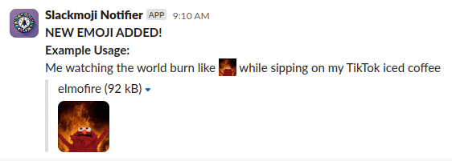

<p align="center">
  <h1 align="center">Slackmoji Notifier</h1>
  <p align="center"></p>
  <p align="center">A fun and interactive Slack bot that notifies users about new emoji additions with AI-generated descriptions.</p>
</p>

## Description

Slackmoji Notifier is a Slack bot that monitors your workspace for new emoji additions. When a new emoji is added, it uses an LLM provider to generate a fun, creative description and sends a notification to a specified Slack channel.

## Features

- Real-time monitoring of new emoji additions in your Slack workspace
- AI-generated descriptions for each new emoji using an LLM provider
- Customizable Slack channel for notifications
- Easy deployment using Helm charts for Kubernetes

## Example



## Installation

### Prerequisites

- Kubernetes cluster
- Helm 3+
- Slack Bot Token and App Token
- API Key for your chosen LLM provider (OpenAI, Anthropic, Google AI, or Ollama setup)

### Helm Chart Installation

Install the chart:

```sh
helm install slackmoji-notifier ./chart \
  --set slack.botToken="your-slack-bot-token" \
  --set slack.appToken="your-slack-app-token" \
  --set slack.channel="#your-notification-channel" \
  --set openai.apiKey="your-openai-api-key" \
  --set openai.model="your-preferred-gpt-model" \
  --set verbose=true
```

### Run it locally

Clone the repository and install dependencies

```sh
git clone https://github.com/particledecay/slackmoji-notifier
go mod download
```

Build and run the application

```sh
go build -o slackmoji-notifier .
./slackmoji-notifier
```

### Run it with Docker Compose

If you prefer to run Slackmoji Notifier using Docker Compose, follow these steps:

1. Set the required environment variables, either by creating a `.env` file or exporting them directly (see [`config.go`](pkg/config/config.go) for the full list).

2. Launch the container:
    ```sh
    docker-compose up -d
    ```

This will pull the latest pre-built image and run the application in a Docker container. The bot will automatically restart unless stopped.

#### Manually building the image

If you want to build the Docker image locally instead of using the pre-built one (to test changes), run:
```sh
docker-compose up --build -d
```

## Configuration

Key configuration options:

- Helm values
    - `slack.channel`: The Slack channel where notifications will be sent
    - `slack.botToken`: Your Slack Bot Token
    - `slack.appToken`: Your Slack App Token
    - `llm.provider`: The LLM provider to use (`openai`, `anthropic`, `googleai`, or `ollama`). Defaults to `openai`.
    - `llm.openai.model`: The OpenAI model to use (e.g., `gpt-5-nano`).
    - `llm.openai.maxTokens`: Maximum tokens for OpenAI responses (default: 1024).
    - `llm.anthropic.model`: The Anthropic model to use (e.g., `claude-3.5-haiku`).
    - `llm.anthropic.maxTokens`: Maximum tokens for Anthropic responses (default: 1024).
    - `llm.googleai.model`: The Google AI model to use (e.g., `gemini-2.5-flash-lite`).
    - `llm.googleai.maxTokens`: Maximum tokens for Google AI responses (default: 1024).
    - `llm.ollama.model`: The Ollama model to use (e.g., `llama3.2:1b`).
    - `llm.ollama.baseURL`: The base URL for the Ollama API (e.g., `http://localhost:11434`).
    - `llm.systemPrompt`: Custom system prompt for all LLM providers (optional).
    - `openai.apiKey`: Your OpenAI API Key
    - `anthropic.apiKey`: Your Anthropic API Key
    - `googleai.apiKey`: Your Google AI API Key
    - `verbose`: Enable verbose logging (default: false)
- Environment variables
    - `SLACK_CHANNEL`: The Slack channel where notifications will be sent
    - `SLACK_BOT_TOKEN`: Your Slack Bot Token
    - `SLACK_APP_TOKEN`: Your Slack App Token
    - `SLACK_LOG_ONLY`: Optional boolean. When true log event instead of sending Slack messages. Useful for debugging and lower environments.
    - `LLM_SYSTEM_PROMPT`: Custom system prompt for all LLM providers (optional).
    - `LLM_PROVIDER`: The LLM provider to use (`openai`, `anthropic`, `googleai`, or `ollama`). Defaults to `openai`.
    - `OPENAI_API_KEY`: Your OpenAI API Key
    - `OPENAI_MODEL`: The OpenAI model to use (e.g., `gpt-5-nano`).
    - `OPENAI_MAX_TOKENS`: Maximum tokens for OpenAI responses (default: 1024).
    - `ANTHROPIC_API_KEY`: Your Anthropic API Key
    - `ANTHROPIC_MODEL`: The Anthropic model to use (e.g., `claude-3.5-haiku`).
    - `ANTHROPIC_MAX_TOKENS`: Maximum tokens for Anthropic responses (default: 1024).
    - `GOOGLEAI_API_KEY`: Your Google AI API Key
    - `GOOGLEAI_MODEL`: The Google AI model to use (e.g., `gemini-2.5-flash-lite`).
    - `GOOGLEAI_MAX_TOKENS`: Maximum tokens for Google AI responses (default: 1024).
    - `OLLAMA_MODEL`: The Ollama model to use (e.g., `llama3.2:1b`).
    - `OLLAMA_BASE_URL`: The base URL for the Ollama API (e.g., `http://localhost:11434`).

For more configuration options, see the [values.yaml](./values.yaml) file.

## Add a custom Slack bot to your workspace

1. Create a new Slack app at [api.slack.com/apps](https://api.slack.com/apps) and click "Create New App"
2. Choose "From scratch"
3. Give it a good name and select your workspace
4. Scroll down and give it the icon at [assets/logo.png](./assets/logo.png)
5. Give it the background color '#6c5994'
6. Click "Save Changes"
7. Click "Socket Mode" in the left sidebar
    1. Click "Enable Socket Mode" and click "Generate" in the popup (this is your `SLACK_APP_TOKEN`)
10. Click "Event Subscriptions" on the resulting page or the left sidebar
    1. Click "On" to enable
    2. Click "Subscribe to bot events"
    3. Click "Add Bot User Event"
    4. Select "emoji:changed"
    5. Click "Save Changes" at the bottom
11. Click "OAuth & Permissions" in the left sidebar
    1. Under "Bot Token Scopes" click "Add an OAuth Scope" and give it the following:
        - `channels:read`
        - `chat:write`
        - `chat:write.public`
        - `emoji:read`
    2. Under "OAuth Tokens" click "Install to <Workspace>" and click "Allow"
    3. Copy the "Bot User OAuth Token" (this is your `SLACK_BOT_TOKEN`)
12. Run the application locally (or within a Kubernetes cluster) and set `SLACK_CHANNEL` to any public channel

## Why?

Emojis are a fun and expressive part of Slack communication. Slackmoji Notifier adds an extra layer of enjoyment by:

- Ensuring no new emoji goes unnoticed
- Providing funny, sometimes nonsensical AI-generated sentences
- Encouraging emoji usage and creativity within your team

## Known Issues

Check out the [Issues](https://github.com/particledecay/slackmoji-notifier/issues) section or specifically [issues created by me](https://github.com/particledecay/slackmoji-notifier/issues?q=is:issue+is:open+sort:updated-desc+author:particledecay)

## Contributing

Contributions are welcome! Please feel free to submit a Pull Request.

## License

This project is licensed under the MIT License - see the [LICENSE](LICENSE) file for details.
